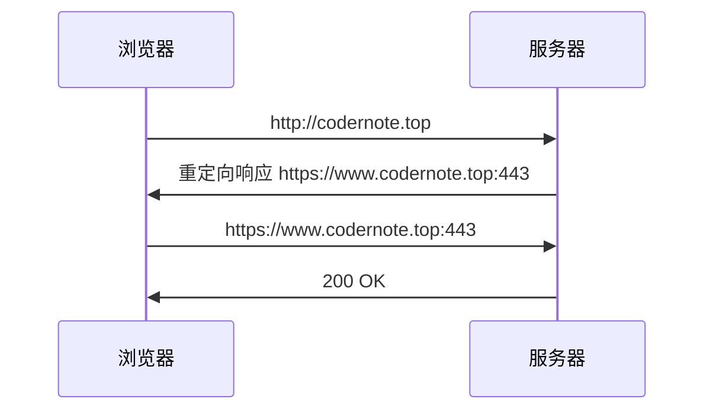
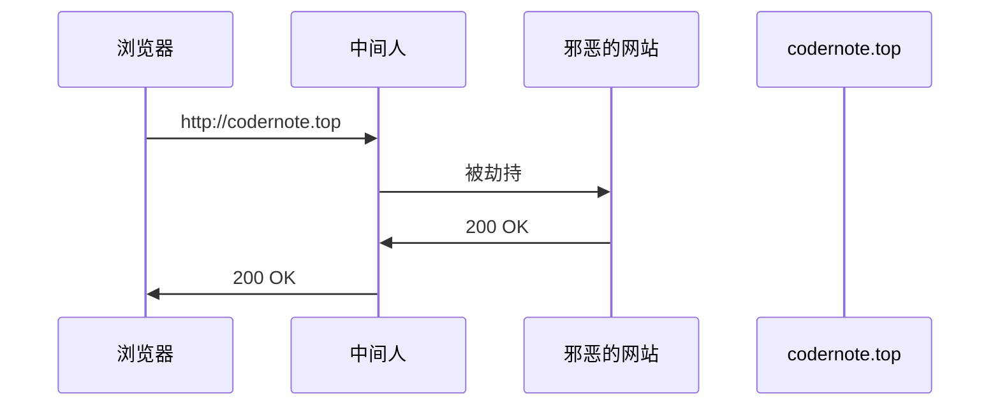
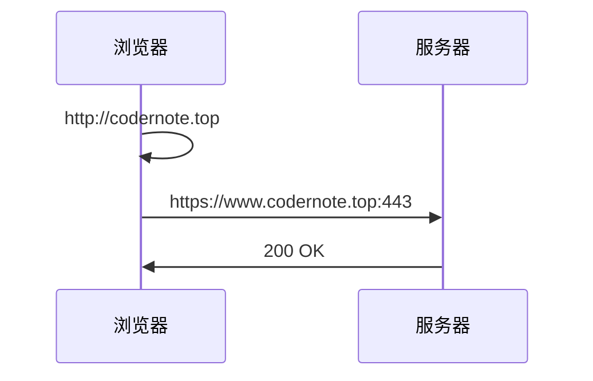

工作测试时遇到 `HSTS` 导致的重定向问题，查阅资料做如下整理。

<!--more-->

## 1. HSTS

### 1.1. 概念与作用

> HSTS 是 HTTP Strict Transport Security 的缩写，即：“ HTTP 严格传输安全”

它的作用是强制客户端使用 HTTPS 与服务器建立连接。

### 1.2. HTTPS 连接建立过程

对于使用 HTTPS 的服务器，客户端建立连接的过程大致如下，用户第一次直接输入网址发起 HTTP 请求，服务器给予用户重定向响应，客户端收到响应发起 HTTPS 请求。



### 1.3. 缺陷

可以很容易发现这一 HTTPS 连接的建立过程存在明显的缺陷，就是存在一次明文通信的 HTTP 请求，容易被中间人劫持，这样就导致 HTTPS 失去了作用。



### 1.4. 解决办法 HSTS

`HSTS` 就是为了解决这一缺陷。浏览器自动将 `HTTP` 转换为 `HTTPS` 请求。实现这一转换过程就要基于服务器的 `HSTS` 响应头，**在第一次成功的请求后获取到响应头，此后在过期时间内，对于该域名的请求都将强制使用`HSTS`**。



### 1.5. HSTS 响应头

```ini
Strict-Transport-Security: <max-age=>[; includeSubDomains][; preload]
```

它由三部分组成

- `max-age` : 必选项，过期时间
- ` includeSubDomains` : 可选，当前域名及子域名域名均开启 `HSTS`
- `preload` : 可选，域名申请加入浏览器内置列表时必须开启此选项

### 1.6. 依然存在的缺陷

但是这种机制下仍然存在漏洞，就是要有一次对目标服务器成功的请求，这一才能获取到包含 `HSTS` 响应头的响应，也就是说仍然需要经历一次由 `HTTP` 到 `HTTPS` 的重定向，也就仍然存在被劫持的风险。

浏览器 `preload list` 用来解决这一缺陷，申请加域名添加至浏览器的  `preload list` 后则所有对该域名的请求都将转换为 `HTTPS`。

## 2. HTTP 3XX 状态码

| 状态码 | 描述               | 备注                           |
| ------ | ------------------ | ------------------------------ |
| 301    | Moved Permanently  |                                |
| 308    | Permanent Redirect |                                |
| 302    | Found              | 临时重定向 POST 不限制具体实现 |
| 303    | See Other          | POST 转为 GET                  |
| 307    | Temporary Redirect | 保持 POST                      |
| 304    | Not Modified       | 无变更                         |
| 305    | Use Proxy          | 必须使用指定的代理访问         |
| 306    | Switch Proxy       | 已废弃                         |

### 2.1. 302、303、307 状态码

`HTTP 1.0` 定义 302 状态码，临时重定向，此时说明原 `URI` 地址依然可用，应该保持。浏览器重定向至响应头中 `Location` 指定的地址，规定对 `POST` 请求重定向是不能改变请求方法，但是各浏览器的实现中并未全部遵守此规定，有的浏览器会将原本 `POST` 请求的重定向转换为 `GET`，而有的浏览器依然保持原请求方法。

在 `HTTP 1.1` 中修改了规范

- 302 状态码对 `POST` 的重定向不再限制，可以转为 `GET` 也可以保持 `POST` 
- 增加 303 状态码，`POST` 的重定向会转为 `GET`
- 增加 307 状态码，`POST` 的重定向会保持 `POST`

也就是说 303、307 状态码是对 302 的补充，保持 302 兼容老版本。

### 2.2. 301、308 状态码

与 302 类似，308 是对 301 的补充，均为永久重定向，但是 301 的实现如 302 , 有时 `POST` 会被转换为 `GET`，而 308 不会进行转换。


