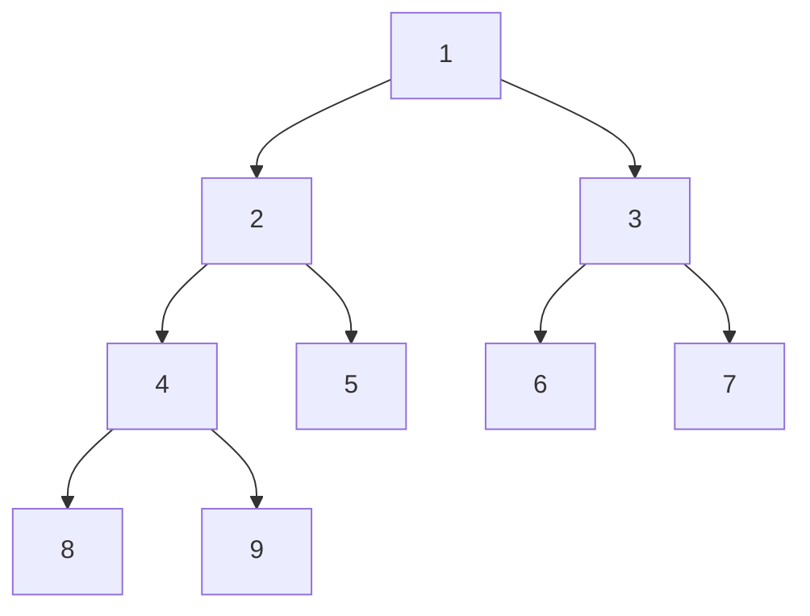
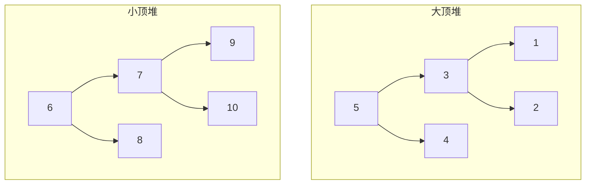

## 堆的数据结构

堆排序所利用的数据结构就是**完全二叉树**，其定义为除了最后一层外，其他各层的节点数都达到最大，并且最后一层的节点都连续集中在最左边。如果最后一层的节点数也达到最大，那么次完全二叉树也是满二叉树。



<!--more-->

而堆的概念是建立在完全二叉树之上的，每个节点的值均*大于*其左右子节点值的完全二叉树为**大顶堆**，而每个节点的值均*小于*其左右子节点值的完全二egq叉树为**小顶堆**。



## 堆排序算法思路

假设待排序样本为`[4, 7, 5, 3, 1, 0, 2]`

- 将样本构建为大顶堆

- 将根结点（堆顶）与最后一个节点交换

- 重新调整堆

- 重复步骤 2、3

## Go代码实现

```go
/**
 * 主函数
 */
func HeapSort(arr []int) []int {
	length := len(arr)
  //初始化构建大顶堆
	buildHeap(arr, length)
	for i := length - 1; i >= 0; i-- {
    //堆顶与尾部交换，交换之后尾部就有序了，length - 1缩短待处理样本
		swap(arr, 0, i)
		length--
    //交换之后大顶堆已被破坏，重新调整
		heapify(arr, 0, length)
	}

	return arr
}

/**
 * 构建大顶堆
 */
func buildHeap(arr []int, length int) {
  //找到最后一个节点，依次向前遍历
	for i := length / 2; i >= 0; i-- {
		heapify(arr, i, length)
	}
}
/**
 * arr 样本
 * node 待调整的节点（数组索引）
 */
func heapify(arr []int, node int, length int) {
  //左右子节点索引
	left := node * 2 + 1
	right := node * 2 + 2
	largest := node
	if left < length && arr[left] > arr[largest] {
		largest = left
	}
	if right < length && arr[right] > arr[largest] {
		largest = right
	}

	if largest != node {
		swap(arr, node, largest)
		heapify(arr, largest, length)
	}
}
/**
 * 交换函数
 */
func swap(arr []int, i int, j int) []int {
	arr[i], arr[j] = arr[j], arr[i]
	return arr
}
```

