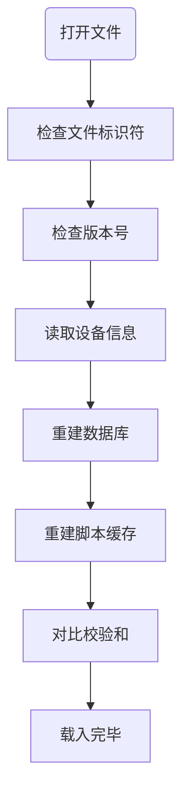
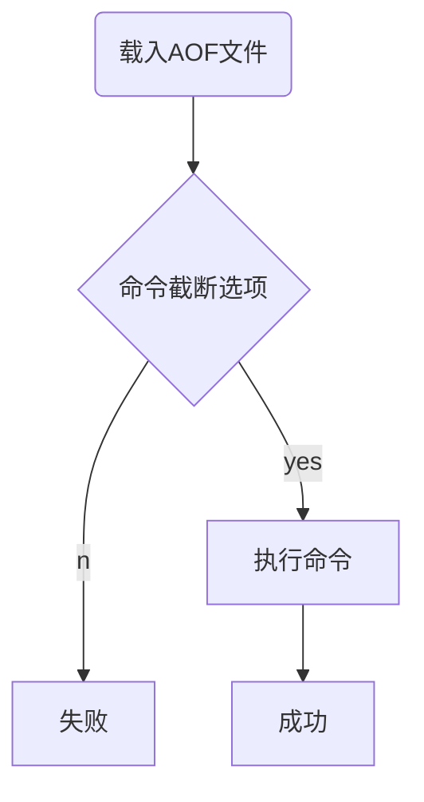
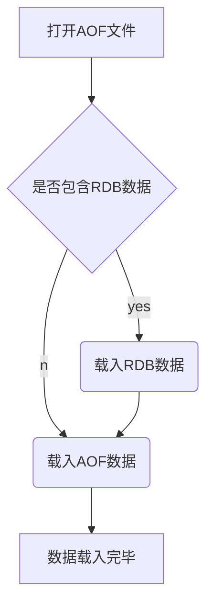

`Redis`的所有数据都在内存中，断电后将全部丢失。数据的持久化功能就是为了解决这一问题。

`Redis`提供了`RDB`、`AOF`以及`RDB-AOF`混合模式。

<!--more-->

## RDB

`RDB`全称为`Redis Database`，是`Redis`默认的持久化方案。这种方式是在某个触发点生成这一时刻的数据库的一个数据快照，存储为`.rdb`为后缀名的一个二进制文件。

### 相关配置

可以在配置文件中进行配置：

```bash
save <seconds> <changes>
save 900 1		# 900秒内变更1次
save 300 10		# 300秒内变更10次
save 60 10000	# 60秒内变更10000次
```

配置触发点，在`seconds`秒内发生了`changes`次数据变更时触发。

```bash
stop-writes-on-bgsave-error < yes | no >
```

配置当后台写入失败时，`Redis`是否停止接受写入，默认为`yes`。

```
rdbcompression < yes | no >
```

是否使用`LZF`方式压缩`RDB`文件。关闭这个配置可能在子进程中节约一些`CPU`，但是如果数据内有可压缩的键值时，`RDB`文件的会比较大。

```bash
rdbchecksum < yes | no >
```

从第五版`RDB`文件开始，在文件的结尾加入了一个`CRC64`校验和。防止文件损坏，但是要付出大约 10% 的性能。

```bash
dbfilename <filename>
```

配置`RDB`文件名，默认为`dump.rdb`。

```bash
dir <path>
```

配置`RDB`文件目录，默认为`/var/lib/redis`。

### 方式及其命令

#### 阻塞式

```bash
save
```

执行`save`命令，`Redis`服务器进入阻塞状态，无法为其他客户端提供服务。`RDB`文件创建成功之后将旧文件替换掉。

#### 非阻塞式

```bash
bgsave
```

`bgsave`命令不会阻塞服务器，而是创建一个子进程，子进程执行`save`命令，创建成功后子进程退出并通知父进程新`RDB`文件已完成，`Redis`服务器进程将旧文件替换掉。

但是由于这一操作要创建子进程，所以父进程占用的内存越大，则创建子进程耗时越长，因此执行此命令时，仍然有可能因为创建子进程导致短暂的阻塞。

在配置文件中的`save`配置，服务器自动执行的就是`bgsave`命令。

#### 命令选择

那么在手动执行时如何决定使用哪个方式呢？

`save`在执行时会阻塞整个服务器，索引如果因为备份的同时为其他客户端提供服务，就应该使用`bgsave`。

`save`执行时不需要创建子进程，在不需要提供服务时，可以使用`save`命令。

#### 数据丢失

`save`命令是阻塞的方式，它的开始和结束是一个原子操作。所以这种方式在停机时丢失的是在最后一次成功执行`save`命令之后产生的所有数据。

`bgsave`的开始和结束是异步的。所以这种采用这种方式，在停机时丢失的是最后一次成功执行`bgsave`命令的开始时间。

### RDB文件结构

- `RDB`文件标识符
- 版本号
- 设备附加信息
- 数据
- `Lua`脚本缓存
- `EOF`
- `CRC64`校验和

#### 文件标识符

文件的开头部分，为`REDIS`这 5 个字符，在载入`RDB`文件的时候会通过这个标识符快速判断是否为`RDB`文件。

#### 版本号

一个长度为 4 个字符的字符串格式的数字，如`0009`，第 9 版。文件的读取版本向下兼容。

#### 设备信息

记录了`Redis`服务器及所在平台的信息，诸如服务器版本号、宿主机架构，创建`RDB`文件的时间戳、服务器占用的内存数量等。

#### 数据

记录了 0 到多个数据库的数据，按数据库的号码从小到大。

每一个数据的数据结构为：

- 数据库号码
- 键值对总数
- 带有过期时间的键值对数量
- 键值对数据部分

载入的时候，首先根据数据库号码切换到指定的数据库。

然后服务器会根据第 2 部分和第 3 部分创建优化数据库的数据结构。

最后的键值对数据中，每一个键值对最多被划分为 5 个部分：

- 过期时间
- `LRU`信息
- `LFU`信息
- 类型
- 键
- 值

`LRU`与`LFU`只会出现一个，因为`Redis`只能选择一种淘汰策略。

#### `Lua`脚本缓存

如果`Redis`启动了复制功能，那么服务器将在这里保存所有已被缓存的`Lua`脚本。

#### EOF

用于标记`RDB`文件正文内容的末尾，它的值为二进制`0XFF`。当服务器读到这里的时候就知道正文部分结束了。

#### `CRC64`校验和

一个无符号 64 位整数。通过它来检验文件是否损坏。

### 载入`RDB`文件



### 缺陷

创建`RDB`文件的时间间隔决定了发生问题时丢失的数据量成正比。`save`或者`bgsave`创建`RDB`文件是存储整个服务器包含的所有数据，频繁的执行这个操作必然影响计算资源性能，不可能以减小操作间隔的方式来保障数据安全。

## AOF

`AOF`的全称为`append only file`。

它是将数据库操作命令增量的保存到一个文件中。

### 相关配置

```bash
appendonly < yes | no >
```

配置开关。

```
appendfilename <filename>
```

配置`AOF`文件名，默认为`"appendonly.aof"`。

```
appendfsync < always | everysec | no >
```

向磁盘刷数据的频率：

- `always`执行一次命令就同步一次（太频繁）
- `everysec`每秒同步一次（默认值）
- `no`不主动同步，具体什么时候同步要依靠系统（不确定性太大，数据丢失隐患大）

```
no-appendfsync-on-rewrite < yes | no >
```

配置`AOF`重写。如果只是增量的向文件添加命令，那么可能会造成命令的大量冗余（如对同一个字符串的多次`set`操作，实际只记录最后一次即可）。

`Redis`提供了`AOF`重写功能来生成新的`AOF`文件，文件包含恢复当前数据库所需的尽可能少的命令。

```bash
# 文件增大的比例，如服务器启动时AOF文件为100M，如果percent值为100，那么代表在文件增大到200时触发重写
auto-aof-rewrite-percentage <percent> 
# AOF文件的体积，当达到size时自动触发AOF重写
auto-aof-rewrite-min-size <size>
```

配置`AOF`重写自动触发频率。

```
aof-load-truncated < yes | no >
```

`AOF`文件中可能存在被截断的命令（正在向`AOF`文件添加命令的时候系统崩溃了），在通过`AOF`文件进行数据恢复时遇到这种有问题的指令如何处理就由这个选项配置，`yes`会忽略这条指令然后继续加载，`no`的话就解决数据恢复失败。

### 相关命令

可以通过`bgrewriteaof`命令手动触发。它会创建一个子进程，创建完成后退出并通知父进程替换掉旧的`AOF`文件。

### 缺陷

- 因为`AOF`文件存储的是命令的`Redis`网络协议格式的文本，所以其体积要比同数据量的`RDB`文件要大。
- 在恢复数据时，`RDB`是直接恢复，而`AOF`要执行命令，所以`RDB`的恢复效率更高。
- `AOF`重写的`bgrewriteaof`命令也需要创建子进程，在数据库体积较大的情况下进行`AOF`重写将占用大量资源，并短暂阻塞。



## AOF 与 RDB 混合持久化

```
aof-use-rdb-preamble < yes | no >
```

通过这个选项来开启`RDB`与`AOF`混合持久化。

这个选项开启后，在进行`AOF`重写时，就会像进行`bgsave`那样，将当前的数据快照生成相应的`RDB`数据，但是这时不会生成`RDB`文件，而是将生成的`RDB`数据内容添加到`AOF`文件中（也就是生成了新的`AOF`文件，但是内容是`RDB`数据）。

之后`redis`执行的命令会也会以网络协议文本的形式继续添加到现有的`AOF`文件末尾。


所以在开启了这个选项之后，生成的`AOF`文件包含两个部分

- `RDB`数据部分
- `AOF`命令协议文本部分

恢复数据时的载入逻辑：

- 判断文件开头是否包含`RDB`数据，如包含则先载入`RDB`数据再载入之后的`AOF`
- 若只包含`AOF`数据，那么服务器将直接载入`AOF`数据

