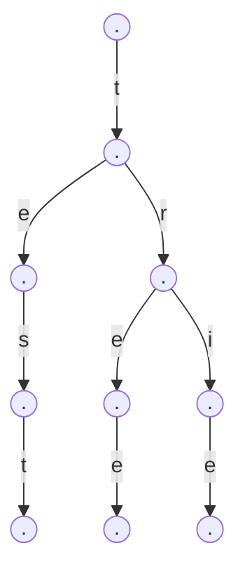
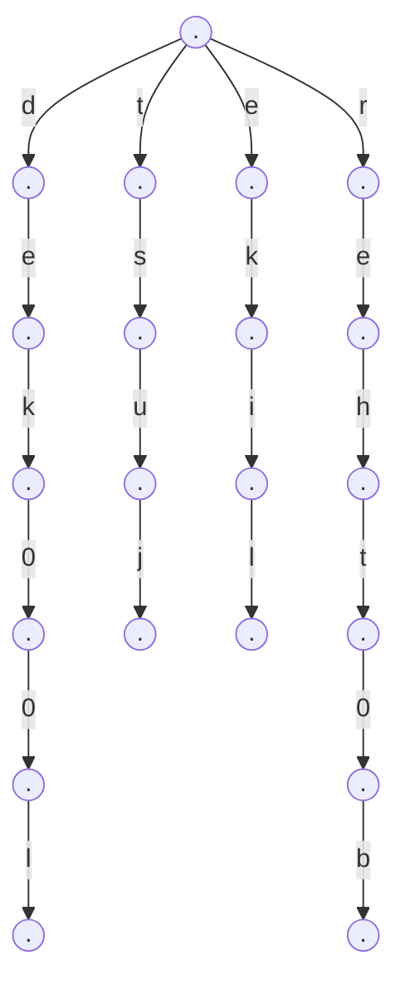

字典树，也叫前缀树。典型应用是用于统计和排序大量字符串、搜素引擎输入关键词提示可能的选项。

它能最大限度的减少无谓的字符串比较。

<!--more-->

## trie

这里先用`golang`实现字典树

```go
type Trie struct {
	Next [26]*Trie
	IsEnd bool
}
```

它的每个节点有 26 个子节点，根据字符向下生长，叶子节点会有终点标识，到这里对一个单词的查账就结束了。

如果字符串的某一个字符没有查到，或者遍历完整个字符串，但是没有达到字典树的叶子节点，也就说明这个字符串在树中不存在。

简单实现插入和搜索方法。

```go
func (t *Trie) Insert(str string) {
	curNode := t
	for i := 0; i < len(str) ;i++ {
		idx := int(str[i] - 'a')//计算字符在26个子节点中的位置
		if curNode.Next[idx] == nil {
			curNode.Next[idx] = &Trie{
				Next: [26]*Trie{},
			}
		}
		curNode = curNode.Next[idx]//切换节点，继续插入下一个字符
	}
	curNode.sEnd = true
}
```

```go
func (t *Trie) Search(str string) bool {
	if str == "" {
		return false
	}
	curNode := t
	for i := 0; i < len(str); i++ {
		idx := int(str[i] - 'a')//计算偏移量
		if curNode.Next[idx] == nil {
			return false //字符不存在
		}
		curNode = curNode.Next[idx]
	}
	if !curNode.IsEnd { //遍历完字符串，但没有达到叶子节点
		return false
	}
	return true
}
```

## 实例

最近`leetcode`的每日一题中遇到一道使用字典树的题目：

> 哦，不！你不小心把一个长篇文章中的空格、标点都删掉了，并且大写也弄成了小写。像句子"I reset the computer. It still didn’t boot!"已经变成了"iresetthecomputeritstilldidntboot"。在处理标点符号和大小写之前，你得先把它断成词语。当然了，你有一本厚厚的词典dictionary，不过，有些词没在词典里。假设文章用sentence表示，设计一个算法，把文章断开，要求未识别的字符最少，返回未识别的字符数。
>
> 注意：本题相对原题稍作改动，只需返回未识别的字符数
>
> 示例：
>
> 输入：
> dictionary = ["looked","just","like","her","brother"]
> sentence = "jesslookedjustliketimherbrother"
> 输出： 7
> 解释： 断句后为"jess looked just like tim her brother"，共7个未识别字符。
> 提示：
>
> 0 <= len(sentence) <= 1000
> dictionary中总字符数不超过 150000。
> 你可以认为dictionary和sentence中只包含小写字母。

这里就是利用`trie`通过字典`dictionary`生成一颗倒叙的字典树，然后我们遍历`sentence`字符串，直到匹配跟节点的时候，再从此处向前遍历字符查找字典树，以此来判断单词是否存在，这样能规避无谓的字符比较。



```go
func respace(dictionary []string, sentence string) int {
	//文章长度
    n := len(sentence)
    //初始化字典树
	root := &Trie{
		next: [26]*Trie{},
	}
	for _, word := range dictionary {
		root.insert(word)
	}
    //定义dp数组
	dp := make([]int, n + 1)
	for i := 1; i <= n; i++ {
        //普通情况，每一个字符都没有匹配，依次 +1
		dp[i] = dp[i - 1] +  1

		curNode := root
        //倒序查找，从跟节点存在的字符向前查
		for j := i; j >= 1; j-- {
			idx := int(sentence[j - 1] - 'a')
			//直到找到根节点的字符才开始向下查
			if curNode.next[idx] == nil {
				break
			} else if curNode.next[idx].isEnd {
                //取最小值
				dp[i] = min(dp[i], dp[j-1])
			}
			if dp[i] == 0 {
				break
			}
			curNode = curNode.next[idx]
		}
	}
	return dp[n]
}
```

