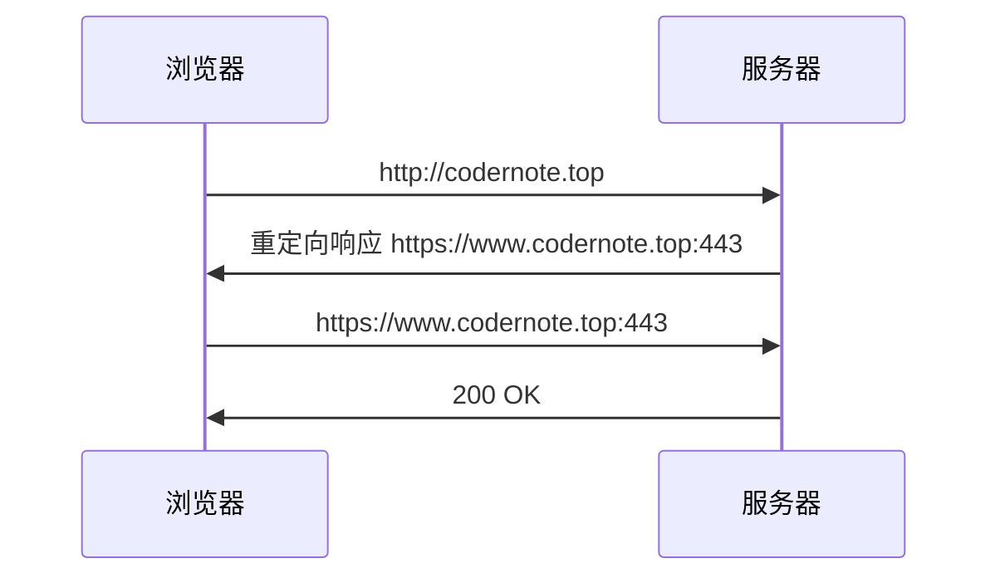

工作测试时遇到 `HSTS` 导致的重定向问题，查阅资料做如下整理。

<!--more-->

## HSTS

### 概念与作用

> HSTS 是 HTTP Strict Transport Security 的缩写，即：“ HTTP 严格传输安全”

它的作用是强制客户端使用 HTTPS 与服务器建立连接。

对于使用 HTTPS 的服务器，客户端建立连接的过程大致如下，用户第一次直接输入网址发起 HTTP 请求，服务器给予用户重定向响应，客户端收到响应发起 HTTPS 请求。

### 缺陷及解决办法

可以很容易发现这一 HTTPS 连接的建立过程存在明显的缺陷，就是存在一次明文通信的 HTTP 请求。

### HSTS 响应头 

## 3XX 状态码

| 状态码 | 描述               | 备注   |
| ------ | ------------------ | ------ |
| 301    | Moved Permanently  |        |
| 308    | Permanent Redirect |        |
| 302    | Found              |        |
| 303    | See Other          |        |
| 307    | Temporary Redirect |        |
| 304    | Not Modified       |        |
| 305    | Use Proxy          |        |
| 306    | Switch Proxy       | 已废弃 |

### 302、303、307

HTTP 1.0 定义 302 状态码

