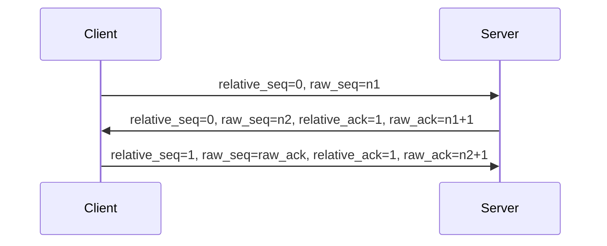

<!--more-->

在浏览器内发起网址请求，不考虑网络层通信细节，只对于 `TCP` 进行三次握手建立链接的过程，抓包具体分析如下

`seq`与`ack`均分为`relative`和`raw`，即相对值与实际值。


*第一次握手*

```ini
Transmission Control Protocol, Src Port: 55879, Dst Port: 80, Seq: 0, Len: 0
    Source Port: 55879
    Destination Port: 80
    [Stream index: 49]
    [TCP Segment Len: 0]
    Sequence number: 0    (relative sequence number)
    Sequence number (raw): 3271402248
    [Next sequence number: 1    (relative sequence number)]
    Acknowledgment number: 0
    Acknowledgment number (raw): 0
    1011 .... = Header Length: 44 bytes (11)
    Flags: 0x002 (SYN)
        000. .... .... = Reserved: Not set
        ...0 .... .... = Nonce: Not set
        .... 0... .... = Congestion Window Reduced (CWR): Not set
        .... .0.. .... = ECN-Echo: Not set
        .... ..0. .... = Urgent: Not set
        .... ...0 .... = Acknowledgment: Not set
        .... .... 0... = Push: Not set
        .... .... .0.. = Reset: Not set
        .... .... ..1. = Syn: Set
            [Expert Info (Chat/Sequence): Connection establish request (SYN): server port 80]
        .... .... ...0 = Fin: Not set
        [TCP Flags: ··········S·]
   
   ......
```

客户端请求，相对`seq`值为 0，实际为 3271402248。`ack` 值为 0

`Flags`中设置 `Syn`。


*第二次握手*

```ini
Transmission Control Protocol, Src Port: 80, Dst Port: 55879, Seq: 0, Ack: 1, Len: 0
    Source Port: 80
    Destination Port: 55879
    [Stream index: 49]
    [TCP Segment Len: 0]
    Sequence number: 0    (relative sequence number)
    Sequence number (raw): 2899824743
    [Next sequence number: 1    (relative sequence number)]
    Acknowledgment number: 1    (relative ack number)
    Acknowledgment number (raw): 3271402249
    1000 .... = Header Length: 32 bytes (8)
    Flags: 0x012 (SYN, ACK)
        000. .... .... = Reserved: Not set
        ...0 .... .... = Nonce: Not set
        .... 0... .... = Congestion Window Reduced (CWR): Not set
        .... .0.. .... = ECN-Echo: Not set
        .... ..0. .... = Urgent: Not set
        .... ...1 .... = Acknowledgment: Set
        .... .... 0... = Push: Not set
        .... .... .0.. = Reset: Not set
        .... .... ..1. = Syn: Set
            [Expert Info (Chat/Sequence): Connection establish acknowledge (SYN+ACK): server port 80]
        .... .... ...0 = Fin: Not set
        [TCP Flags: ·······A··S·]
    
    ......
```

服务端应答，`ack`值为上一步的`seq`值`+1`，所以相对`ack`值为 `0+1=1`，`ack`值为`3271402248+1=3271402249`。相对`seq`值为 0，实际`seq`值为 2899824743。

`Flags`中设置 `Syn`和`Acknowledgment`。


*第三次握手*

```ini
Transmission Control Protocol, Src Port: 55879, Dst Port: 80, Seq: 1, Ack: 1, Len: 0
    Source Port: 55879
    Destination Port: 80
    [Stream index: 49]
    [TCP Segment Len: 0]
    Sequence number: 1    (relative sequence number)
    Sequence number (raw): 3271402249
    [Next sequence number: 1    (relative sequence number)]
    Acknowledgment number: 1    (relative ack number)
    Acknowledgment number (raw): 2899824744
    0101 .... = Header Length: 20 bytes (5)
    Flags: 0x010 (ACK)
        000. .... .... = Reserved: Not set
        ...0 .... .... = Nonce: Not set
        .... 0... .... = Congestion Window Reduced (CWR): Not set
        .... .0.. .... = ECN-Echo: Not set
        .... ..0. .... = Urgent: Not set
        .... ...1 .... = Acknowledgment: Set
        .... .... 0... = Push: Not set
        .... .... .0.. = Reset: Not set
        .... .... ..0. = Syn: Not set
        .... .... ...0 = Fin: Not set
        [TCP Flags: ·······A····]
    
    ......
```

客户端应答，相对`seq`值为 1，实际`seq`值为上一步服务端响应的实际`ack`值，相对`ack`值为 1，实际`ack`值为上一步服务端响应的实际`seq`值`+1`。

`Flags`中设置 `Syn`和`Acknowledgment`。


至此，`TCP`链接建立完毕。