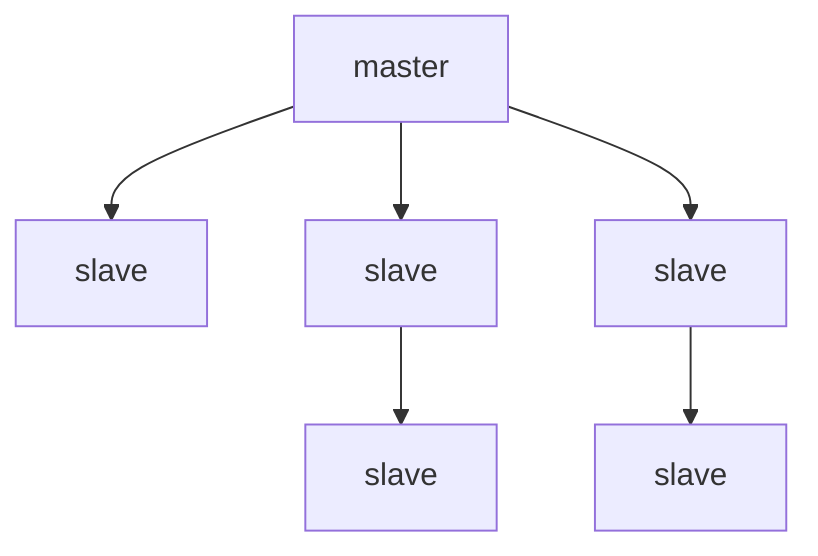
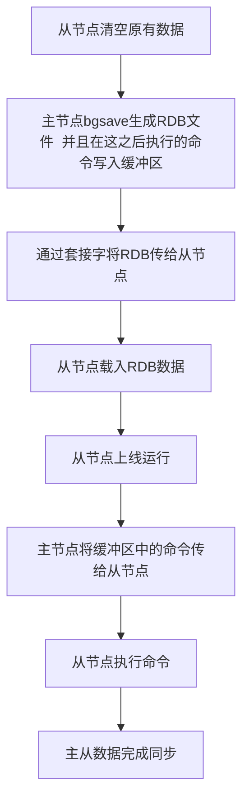
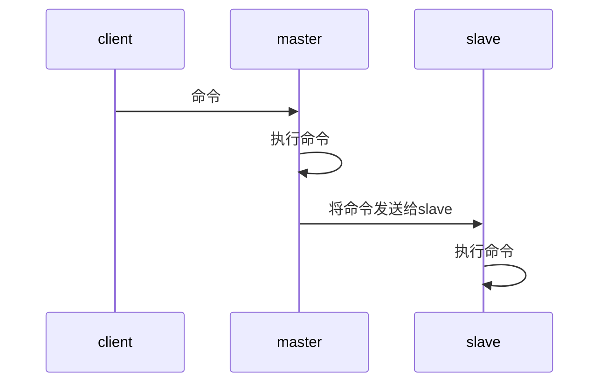
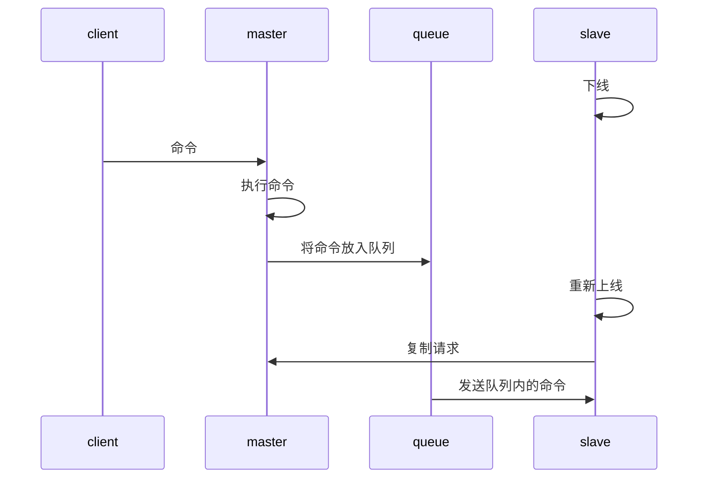

单机的`Redis`容易发生单点故障，服务器负载较大时的处理性能也有很大局限。

因此`Redis`提供主从复制机制，可以提高发生灾难性问题时数据的安全性，也能分担服务器负载压力。

网络内只有一个`master`节点，多个`slave`节点，`master`节点有多个`slave`，一个`slave`只有一个`master`节点。如上图所示。

<!--more-->

## 相关命令与配置

### 命令

```bash
replicaof <masterip> <masterport>
```

将当前`redis`服务器设置为指定`master`节点的`slave`节点。

```bash
replicaof no one
```

取消复制。

```bash
role
```

查看节点角色

`master`执行此命令返回 3 个元素的列表：

- 字符串`master`
- 主服务器的复制偏移量
- 记录所有下属`slave`节点的数组
  - `IP`
  - 端口号
  - 复制偏移量（当与主服务器的复制偏移量一直时，主从数据才是同步的）

`slave`执行此命令返回 5 个元素组成的列表：

- 字符串`slave`
- `master`的`IP`
- `master`的端口号
- 目前与主服务器的链接状态
  - `none`
  - `connect`
  - `connecting`
  - `sync`
  - `connected`
  - `unkonwn`

### 配置

```bash
replica-read-only < yes | no >
```

设置从`slave`节点的只读模式。

```bash
repl-diskless-sync < yes | no >
```

默认为`no`，完整同步数据时，`master`节点创建`RDB`文件并传给`slave`。

如果设为`yes`，则`master`创建子进程并在其中创建当前数据的`RDB`数据并直接传给`slave`（不写入`master`节点的磁盘），但是在`slave`节点接受到`RDB`数据后依然需要写盘。

```bash
repl-diskless-sync-delay <seconds>
```

`repl-diskless-sync`选项开启后，可以用这个选项来配置传输延迟的秒数。

在这个等待时间内可能有多个`slave`连接上来，这样就可以一起传输，否则一旦传输开始，后链接上的`slave`只能等待。

禁用的话可以设置为 0。

## 数据同步方式

### 完整同步

当一个节点成为一个主节点的从节点之后，会进行一次完整的同步：



### 在线更新

主服务器有新的命令执行后，就会将命令发送给从服务器，从服务器执行成功后，完成数据的在线更新。



在`slave`节点执行了命令之后，数据完成同步。

但是可以看出，从`master`执行了命令，到`slave`执行完成命令这一段时间，数据存在短暂的不一致。

### 部分同步

当下线的节点重新上线时，与主服务器数据已不再一致，此时需要进行同步。

老的处理方法是进行一次完整同步，但如果这个从服务器只是短暂下线，那么数据的差异很小，进行完整同步就十分没有必要并且很耗费资源。

新的数据同步策略是：



在`slave`重新上线后，`master`先查看`slave`下线期间执行的命令是否在队列内，如果在则将命令发送给`slave`，否则执行一次完整同步。

```bash
repl-backlog-size <size>
```

可以通过这个配置来设置`FIFO`队列的大小。


