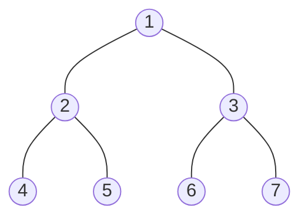

二叉树的遍历可以分为深度优先遍历和广度优先遍历两种

深度优先遍历也就是常说的前序、中序、后序遍历，可以通过递归和栈两种方式来实现

广度优先遍历就是按层次顺序遍历，可以通过队列来实现

上图四种遍历方式的结果依次为

**前序遍历：**1， 2，4，5，3，6，7

**中序遍历：**4、2， 5，1，6，7，3

**后序遍历：**4， 5、2，6，7，3，1

**广度优先遍历：**1， 2，4，5，3，6，7

<!--more-->

## 树结构定义

```go
type Node struct {
	Data  int
	Left  *Node
	Right *Node
}
func (n *Node) Print() {
	fmt.Print(n.Data, " ")
}
```

## 深度优先遍历

<div align="left"></div>

### 递归实现

#### 前序遍历

```go
func (n *Node) PreOrder() {
  //先给出递归终止条件
	if n == nil {
		return
	}
	//前序的顺序：当前节点->左子树->右子树
	n.Print()
	if n.Left != nil {
		n.Left.PreOrder()
	}
	if n.Right != nil {
		n.Right.PreOrder()
	}
  return
}
```

 #### 中序遍历

```go
func (n *Node) InOrder() {
	//先给出递归终止条件
  if n == nil {
		return
	}
	//中序的顺序：左子树->当前节点->右子树
	if n.Left != nil {
		n.Left.MiddleOrder()
	}
	n.Print()
	if n.Right != nil {
		n.Right.MiddleOrder()
	}
  return
}
```

#### 后序遍历

```go
func (n *Node) PostOrder() {
  //先给出递归终止条件
	if n == nil {
		return
	}
	//后序的顺序：左子树->右子树->当前节点
	if n.Left != nil {
		n.Left.PostOrder()
	}
	if n.Right != nil {
		n.Right.PostOrder()
	}
	n.Print()
  return
}
```

### 迭代实现

递归实现比较直观，层数过多时对性能影响较大

出了递归还可以通过栈结构来辅助实现迭代遍历，但相较于递归方式就不那么容易理解

简单的实现了一个栈

```go
type Stack struct {
	sync.Mutex
	size     int
	capacity int
	data     []interface{}
}
//创建
func New(size int) *Stack {
	arr := make([]interface{}, size)
	return &Stack{
		capacity: cap(arr),
		data:     arr,
	}
}
//入栈
func (s *Stack) Push(e interface{}) {
	s.Lock()
	defer s.Unlock()

	if s.size+1 > s.capacity {
		newArray := make([]interface{}, s.capacity*2)
		for i := 0; i < s.size; i++ {
			newArray[i] = s.data[i]
		}
		s.data = newArray
	}
	s.data[s.size] = e
	s.size += 1
}
//出栈
func (s *Stack) Pop() interface{} {
	s.Lock()
	defer s.Unlock()
	if s.size <= 0 {
		return nil
	}
	top := s.data[s.size-1]
	s.size -= 1
	return top
}
//判断是否为空
func (s *Stack) IsEmpty() bool {
	return s.size <= 0
}
//获取栈元素数量
func (s *Stack) Size() int {
	return s.size
}
```

#### 前序遍历

```go
func (n *Node) PreOrder() {
	if n == nil {
		return
	}
	currNode := n
	s := stack.New(5)
    //思考一下整体过程：从根节点开始入栈->紧接着出栈->打印当前节点->右节点入栈，左节点入栈->紧接着左节点出栈
    //循环这个过程
	for currNode != nil || !s.IsEmpty() {
		if currNode != nil {
			currNode.Print()
			//考虑出栈时的顺序，因此入栈时先右后左入栈
			s.Push(currNode.Right)
			s.Push(currNode.Left)
		}
		if !s.IsEmpty() {
			currNode = s.Pop().(*Node)
		}
	}
	return
}
```

#### 中序遍历

```go
func (n *Node) InOrder()  {
	if n == nil {
		return
	}
	currNode := n
	s := stack.New(5)
    //思考整体过程：中序，所以要沿着左子树先入栈
    //出栈时候的动作为：打印当前节点->切换到右子树，因为出栈时的节点必然是沿着左子树到大的叶子节点，这是好它的左右节点为nil
    //切换到它的右节点也为nil，所以开始出栈第二个节点，也就是叶子节点的父节点，同样执行打印，切换到右节点，这样就实现了中序
	for currNode != nil || !s.IsEmpty() {
		for currNode != nil {
			s.Push(currNode)
			currNode = currNode.Left
		}
		if !s.IsEmpty() {
			currNode = s.Pop().(*Node)
			currNode.Print()
			currNode = currNode.Right//切换到右子树，右子树如果有它的左子树，依然沿着左子树一路向下入栈
		}
	}
	return
}
```

#### 后序遍历

```go
func (tn *TreeNode) PostOrder() {
	if tn == nil {
		return
	}
	var (
		currNode = tn
		preNode *TreeNode
		stack = New(5)
	)
    //思考整体过程：后序也是要先沿着左子树一路向下的到左叶子节点入栈
    //第一个出栈的也就是最左侧的叶子节点，之后向上出栈的也同样都是左节点，所以不需要判断left
    //因为后序是最后打印当前节点，所以我们需要一个辅助变量preNode来记录上一个遍历到的节点，如果它是当前节点的右子节点，就表明后序遍历完成，可以打印当前节点，否则就将currNode切换到它的Right上
	for currNode != nil || !stack.IsEmpty() {
		for currNode != nil {
			stack.Push(currNode)
			currNode = currNode.Left
		}
		currNode = stack.Pop().(*TreeNode)
		if currNode.Right == nil || currNode.Right == preNode {
			currNode.Print()
			preNode = currNode
			currNode = nil
		} else {
			currNode = currNode.Right
		}
	}
	return
}
```

## 广度优先遍历

<div align="left"></div>

```go
func (n *Node) BreadthFirstSearch() {
	if n == nil {
		return
	}
	nodes := []*Node{n}//根节点入队
	for len(nodes) > 0 {
		curNode := nodes[0]
		curNode.Print()
		nodes = nodes[1:]//出队
    //先左后右入队
		if curNode.Left != nil {
			nodes = append(nodes, curNode.Left)
		}
		if curNode.Right != nil {
			nodes = append(nodes, curNode.Right)
		}
	}
}
```


